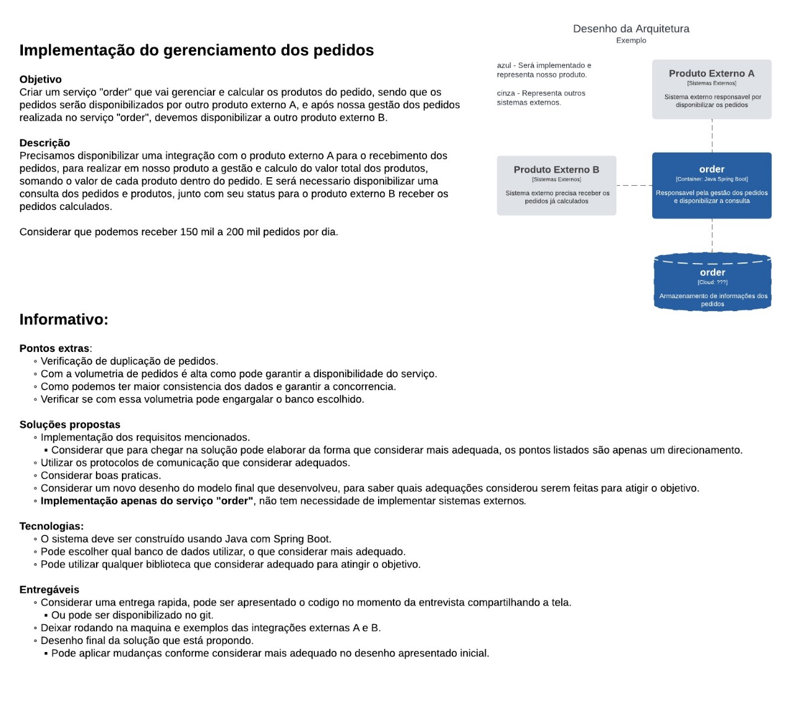
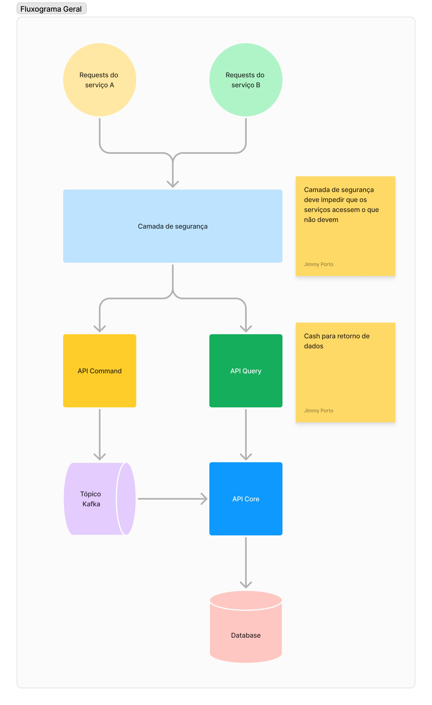
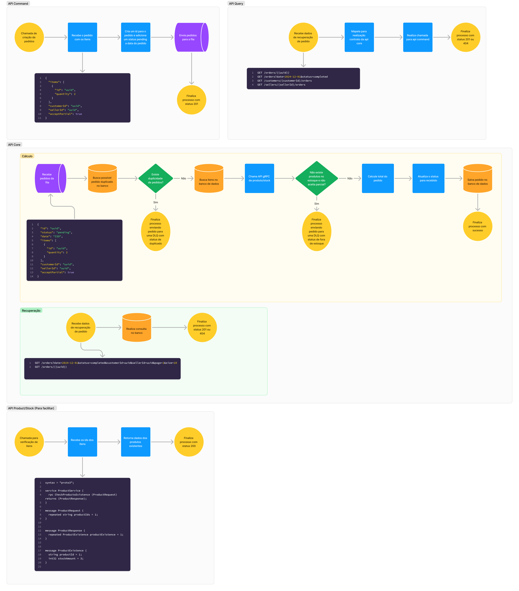
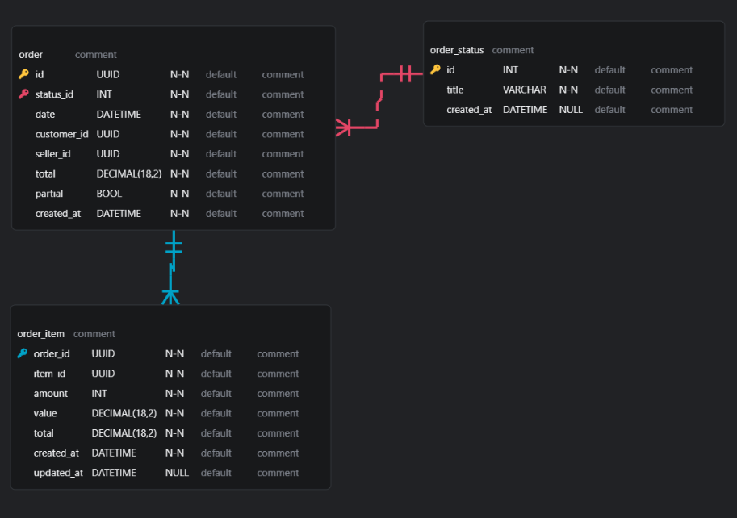

# Order Service

Essa arquitetura foi pensada de maneira a criar um serviço de pedidos.

## Descrição

A intensão com esse projeto é criar uma arquitetura para resolver os problemas de um serviço que precisa receber ser aceçado por outros dois serviços sendo um que realiza o salvamento de um pedido enquanto outro é responsável pelas consultas de pedidos.

 > ### Atenção: a camada de Gateway não foi implementada

## Problema proposto

## Design da arquitetura

## Archtecture

## Database

